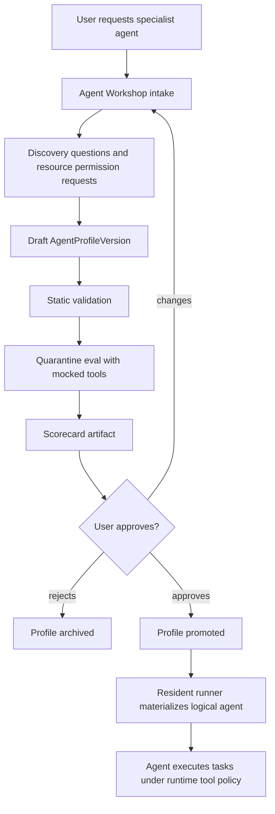

# Agent Builder Runtime Integration Plan

Workstream: Agent Harness
Date: 2026-05-10
Status: proposed runtime integration

## Purpose

The Agent Workshop / Agent Creator work should produce approved, versioned agent
profiles that the resident user runner can materialize into logical agents. The
runtime should not treat a generated profile as trusted code. It should verify,
materialize, enforce policy, run quarantine or smoke checks, and only then
execute work.

## Existing Agent Creator State

Active untracked work exists under `services/agent-creator/`. Agent Harness
should treat it as read-only unless explicitly coordinated.

Observed behavior:

- deterministic workshop request model,
- candidate tools with low/medium/high risk,
- discovery questions for success criteria, sources, autonomy, cadence, and
  eval examples,
- draft profile renderer,
- behavior policy fields for verbosity, communication cadence, report style,
  escalation policy, and feedback adaptations,
- tool policy split into allowed, approval-required, and denied tools,
- eval plan generation,
- scorecard that blocks promotion until eval evidence and user approval exist,
- CLI/Docker test interface planned for deterministic JSON output.

Relevant plan:

```text
docs/plans/2026-05-10-adaptive-agent-workshop-implementation-plan.md
```

Runtime implication: Agent Harness should plan for immutable
`AgentProfileVersion` bundles, not ad hoc prompts.

## Target Profile Lifecycle



## Profile Bundle Contract

The runtime should consume an immutable profile bundle, not a mutable service
response.

Target bundle:

```text
profile.json
SOUL.md
config.fragment.yaml
skills/README.md
policy/tool-policy.json
policy/mcp-policy.json
evals/eval-pack.json
scorecards/latest.json
CHANGELOG.md
manifest.json
```

Minimum `manifest.json` fields:

```json
{
  "schemaVersion": "2026-05-10",
  "profileId": "marketing-strategist",
  "version": "0.1.0",
  "workspaceId": "workspace-abc",
  "createdAt": "2026-05-10T00:00:00.000Z",
  "files": [
    {
      "path": "profile.json",
      "sha256": "..."
    }
  ],
  "policy": {
    "toolPolicyHash": "...",
    "mcpPolicyHash": "...",
    "evalPackHash": "..."
  },
  "promotion": {
    "approvedBy": "user-123",
    "approvedAt": "2026-05-10T00:00:00.000Z",
    "scorecardArtifactId": "artifact-123"
  }
}
```

Runtime materialization must:

1. fetch bundle metadata,
2. download files into an isolated profile directory,
3. verify manifest hashes,
4. reject secret-looking values,
5. reject unknown or broad tool policies,
6. materialize prompt/config/skills into `HERMES_HOME` or an equivalent runtime
   profile path,
7. register a logical agent instance with profile ID/version,
8. emit materialization status and a report artifact.

## Logical Agent State

Resident runner state should distinguish runner identity from logical agents:

```ts
interface LogicalAgentInstance {
  agentInstanceId: string;
  profileId: string;
  profileVersion: string;
  role: string;
  status:
    | "idle"
    | "planning"
    | "running"
    | "waiting_for_user"
    | "waiting_for_approval"
    | "waiting_for_tool"
    | "delegated"
    | "blocked"
    | "failed"
    | "succeeded";
  activeTaskIds: string[];
  waitStateIds: string[];
  wakeTimerIds: string[];
}
```

The user runner can host multiple logical agents. A manager/executive agent can
delegate to specialist logical agents without spawning a new ECS container until
workload, isolation, or policy requires it.

## User-Tunable Behavior

User modifications should become profile or preference changes, not only chat
history.

Examples:

| User request | Runtime/Workshop interpretation |
| --- | --- |
| "This agent is too verbose" | Profile change request for `verbosity=concise`; requires eval rerun |
| "Do not call me all the time" | Communication policy update; batch non-critical updates |
| "Only use this paid API when needed" | Tool cost policy changes to approval or budgeted |
| "Make a stock dashboard site" | Task with preview/artifact tools; may request subdomain label |
| "Create a marketing agent" | Agent Workshop request for new profile draft and eval pack |

The runtime should apply preferences in this order:

```text
platform defaults
  -> org standards
  -> user preferences
  -> workspace/project preferences
  -> agent profile behavior
  -> task override
```

Conflicts should be visible in the scorecard or run events when they affect
what the agent can do.

## Runtime Contract With Agent Workshop

Agent Harness needs these profile-facing contracts:

```text
AgentProfileRef
AgentProfileVersionManifest
AgentProfileMaterializationResult
AgentProfileRuntimePolicy
AgentProfileEvalSummary
```

The resident runner should support these commands:

```text
materialize_profile(profileRef)
instantiate_logical_agent(profileRef, role, initialState)
retire_logical_agent(agentInstanceId)
request_profile_tuning(profileRef, feedback)
```

Materialization should be testable with local files first:

```text
local profile bundle path
  -> manifest verification
  -> temp profile root
  -> logical agent instance state
  -> local event/artifact sinks
```

## Runtime Status Mapping

Clients should not need raw internal tool calls. They need status, messages,
questions, approvals, artifacts, and generated surfaces.

Initial runtime status mapping:

| Runtime condition | Public status |
| --- | --- |
| profile materializing | `planning` |
| logical agent has active work | `running` |
| eval/test tool is running | `testing` |
| waiting for user answer | `waiting_for_approval` until protocol adds question/wait states |
| waiting for approval | `waiting_for_approval` |
| artifact upload/finalization | `archiving` |
| no runnable tasks but wake timer exists | future `waiting` or internal runner state |
| task cancelled | `cancelled` |
| unrecoverable error | `failed` |

Protocol should eventually separate `waiting_for_user`,
`waiting_for_approval`, and `sleeping_until_wake`, but the current public
`RunStatus` only has `waiting_for_approval`.

## Execution Pattern

Manager/specialist task flow:

```text
user objective
  -> manager logical agent creates plan
  -> manager creates specialist tasks
  -> resident runner schedules specialist logical agents
  -> specialists use tools through policy gateway
  -> artifacts and status events are emitted
  -> manager summarizes and asks for approvals/questions as needed
```

The model may propose delegation, but the runner owns task records, state
transitions, event ordering, retries, and cancellation.

## Implementation Slices

### Slice A: Profile Runtime Types

Add types in `services/agent-runtime`:

```text
AgentProfileRef
AgentProfileManifest
AgentProfileMaterializationState
LogicalAgentInstance
AgentPreferencePolicy
```

Add validation tests with no AWS dependencies.

### Slice B: Local Profile Materializer

Add a local bundle materializer that:

- loads manifest,
- checks required files,
- verifies hashes,
- rejects secret-looking values,
- writes a materialized profile directory,
- returns a logical agent seed state.

### Slice C: Tool Policy Bridge

Map profile `toolPolicy` into runtime `AgentToolPolicy` and prove:

- low-risk tools are allowed,
- medium/high tools require approval,
- denied tools are blocked,
- unknown tools are blocked,
- profile text cannot override runtime policy.

### Slice D: Agent Tuning Request

Add a runtime command/event intent for:

```text
request_profile_tuning(profileRef, feedback, evidenceRefs)
```

The command should create a task or artifact intent only. Control API/Agent
Workshop can own persistence and UI.

## Handoff Needs

Agent Harness needs from Agent Creator/Product Coordination:

- final `AgentProfileVersion` schema owner,
- profile lifecycle state names,
- bundle storage location,
- scorecard artifact shape,
- initial demo roles and profiles,
- whether profile tuning is a normal user request or a separate workshop run.

Agent Harness needs from Protocol:

- profile lifecycle event names,
- `tool.approval` TypeScript builders,
- separate wait/question/status payloads if clients need non-approval waits.

Agent Harness needs from Infrastructure:

- S3 profile bundle prefixes,
- task env vars for materialization,
- IAM read permissions for approved profile bundle paths,
- runner state/snapshot paths.

