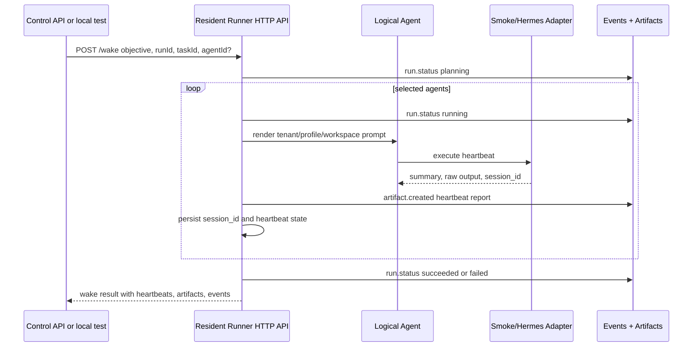

# Resident ECS Container

Workstream: Agent Harness
Date: 2026-05-10
Status: first local/ECS-shaped resident runner container implemented; production launch wiring still pending

## Purpose

This document captures the resident agent container created for Agents Cloud.
It is the runtime-owned bridge between:

- Paperclip-style scheduled heartbeats and isolated execution workspaces,
- Hermes-style CLI agent sessions and provider selection,
- Agents Cloud tenant/run/event/artifact contracts,
- ECS task placement that can later run one resident user runner per tenant,
  workspace, or user-runner placement decision.

The old `services/agent-runtime/Dockerfile` remains the short one-shot smoke
worker. The new `services/agent-runtime/Dockerfile.resident` is a separate
resident runner image and should be launched only through the user-runner path.

## External References Audited

Paperclip patterns to keep:

- agents are woken by scheduled or event heartbeats instead of one endless model
  call,
- wakeups should coalesce so duplicate work is not started,
- agent state should persist across heartbeats,
- each agent needs a resolved workspace before it acts,
- tenant/company data must stay scoped,
- approval gates and budgets must stop unsafe or runaway work.

Hermes Paperclip adapter patterns to keep:

- invoke Hermes as a CLI adapter with a bounded single-query command,
- persist and reuse `session_id` on later heartbeats,
- pass provider/model/toolset options explicitly,
- support providers like OpenRouter and OpenAI Codex where configured,
- capture stdout/stderr and usage metadata without exposing secrets.

Hermes Docker/profile patterns to keep:

- non-root runtime user,
- persistent `HERMES_HOME`,
- one data volume per runner/profile boundary,
- bootstrap auth only from a trusted secret path,
- never hardcode `~/.hermes` when profile isolation is required.

Important source links:

- https://github.com/paperclipai/paperclip
- https://github.com/NousResearch/hermes-paperclip-adapter
- https://github.com/nousresearch/hermes-agent
- https://hermes-agent.nousresearch.com/docs/user-guide/docker

## Implemented Container Shape

New files:

```text
services/agent-runtime/Dockerfile.resident
services/agent-runtime/src/resident-runner.ts
services/agent-runtime/src/resident-runner-server.ts
services/agent-runtime/test/resident-runner.test.ts
```

New root scripts:

```bash
pnpm agent-runtime:resident:server
pnpm agent-runtime:resident:docker:build
pnpm agent-runtime:resident:docker
```

New CDK outputs:

```text
resident-runner-task-definition-arn
resident-runner-container-name
```

The resident image:

- runs as non-root user `runner`,
- exposes HTTP port `8787`,
- stores local runner data under `/runner`,
- sets `HERMES_HOME=/runner/hermes`,
- defaults to deterministic `smoke` adapter mode,
- can switch to `hermes-cli` mode when Hermes is installed in a future image
  layer and `AGENTS_RESIDENT_ADAPTER=hermes-cli` is set.

## Runtime Contract

The HTTP API is intentionally small and local-to-runner shaped:

| Method | Path | Purpose |
| --- | --- | --- |
| `GET` | `/health` | runner liveness and current runner status |
| `GET` | `/state` | inspect current runner, logical agents, heartbeats, and metrics |
| `GET` | `/events` | inspect canonical event ledger written by this runner |
| `POST` | `/agents` | register or update one logical agent profile in the runner |
| `POST` | `/wake` | wake one agent or all registered agents for an objective |
| `POST` | `/shutdown` | stop the local server cleanly |

- If `RUNNER_API_TOKEN` is set, every endpoint requires:

```text
Authorization: Bearer <token>
```

For local developer mode, an omitted `RUNNER_API_TOKEN` leaves the HTTP server open on the local machine for quick testing. For ECS-shaped resident mode, `AGENTS_RUNTIME_MODE=ecs-resident` now fails closed at startup unless `RUNNER_API_TOKEN` is present. Production launch must replace this local bearer token with a scoped supervisor/runner token broker before any resident task is exposed beyond a trusted control-plane boundary.

JSON write endpoints reject malformed JSON as `400`, reject non-JSON content types as `415`, and cap request bodies at 1 MiB.

The runtime currently emits durable canonical events only for:

- `run.status`,
- `artifact.created`.

Routine internal tool churn is not persisted as canonical events. The runner
keeps aggregate heartbeat/artifact/event metrics in local state.

## Multi-Agent Profile Model

The resident runner can host multiple logical agents for the same tenant:

```json
{
  "agentId": "agent-coder",
  "profileId": "coder-agent",
  "profileVersion": "v1",
  "role": "Coder Agent",
  "provider": "openrouter",
  "model": "openrouter/anthropic/claude-sonnet-4",
  "toolsets": "file,terminal,web",
  "tenant": {
    "orgId": "org-123",
    "userId": "user-123",
    "workspaceId": "workspace-123"
  }
}
```

Tenant mismatch is rejected at registration time. Agent/profile identifiers are restricted to safe path/key characters before profile files, workspace directories, or artifact paths are written. Explicit `cwd` overrides must resolve under `/runner/workspace`; attempts to escape the runner workspace are rejected. Each registered agent gets a separate workspace directory:

```text
/runner/workspace/<agentId>
```

The current implementation uses local file state. Production restore must map
this to `RunnerSnapshots` and S3 snapshot prefixes before long-running state is
treated as durable.

## Wake Flow



## Auth And Model Provider Boundary

Supported provider labels in the runner profile/env contract:

```text
auto
openrouter
openai-codex
copilot
anthropic
nous
custom
```

Production-safe credential stance:

- use Secrets Manager, brokered credential refs, or task-scoped env injection,
- do not send refresh tokens to arbitrary agent code,
- do not log raw provider keys or auth JSON,
- do not expose ChatGPT/Codex OAuth sessions to untrusted multi-tenant runners
  until policy, terms, session refresh, revocation, and isolation are resolved.

The implemented container is ready for `OPENROUTER_API_KEY`,
`OPENAI_API_KEY`, or Hermes-compatible secret injection at task launch, but it
does not implement a public ChatGPT login/OAuth handoff. That should remain a
private trusted-runner experiment until Product/Legal/Security approve it.

Hermes adapter child processes do not inherit the full ECS task environment.
The spawn environment is allowlisted so AWS task credentials, runner tokens,
table names, and bucket names are not passed into agent code. Raw provider keys
are also withheld by default; setting
`AGENTS_ALLOW_RAW_PROVIDER_KEYS_TO_AGENT=1` is an explicit trusted-runner opt-in
for local/private testing only.

## Local Docker Test

Build the resident image:

```bash
pnpm agent-runtime:resident:docker:build
```

Run it with a local API token:

```bash
docker run --rm \
  -p 127.0.0.1:18787:8787 \
  -e RUNNER_API_TOKEN=test-token \
  -e ORG_ID=org-local \
  -e USER_ID=user-local \
  -e WORKSPACE_ID=workspace-local \
  -e RUNNER_ID=runner-local \
  agents-cloud-agent-runtime-resident:local
```

Register a second logical agent:

```bash
curl -sS http://127.0.0.1:18787/agents \
  -H 'authorization: Bearer test-token' \
  -H 'content-type: application/json' \
  -d '{
    "agentId": "agent-coder",
    "profileId": "coder-agent",
    "profileVersion": "v1",
    "role": "Coder Agent",
    "provider": "openrouter",
    "model": "openrouter/test-model",
    "toolsets": "file,terminal,web",
    "tenant": {
      "orgId": "org-local",
      "userId": "user-local",
      "workspaceId": "workspace-local"
    }
  }'
```

Wake the agent:

```bash
curl -sS http://127.0.0.1:18787/wake \
  -H 'authorization: Bearer test-token' \
  -H 'content-type: application/json' \
  -d '{
    "objective": "Create a stock dashboard and summarize the artifact plan.",
    "agentId": "agent-coder",
    "runId": "run-local-docker",
    "taskId": "task-local-docker",
    "wakeReason": "on_demand"
  }'
```

Inspect state/events:

```bash
curl -sS http://127.0.0.1:18787/state -H 'authorization: Bearer test-token'
curl -sS http://127.0.0.1:18787/events -H 'authorization: Bearer test-token'
```

Shutdown:

```bash
curl -sS -X POST http://127.0.0.1:18787/shutdown -H 'authorization: Bearer test-token'
```

## Production Gaps

This is not yet ready to push as the production resident runner for users.
Remaining work:

- add Hermes CLI into a dedicated production image layer or choose a pinned
  upstream Hermes image base,
- add task launch flow that injects per-runner tenant/user/workspace/profile env
  overrides,
- replace local JSON/NDJSON state with DynamoDB/S3-backed adapters,
- implement snapshot upload/restore with `RunnerSnapshots`,
- add heartbeat writes to `UserRunners` and stale-runner behavior,
- add inbox polling or push delivery for user replies, approvals, and scheduled
  wakes,
- add approval request/decision handling in the resident runner server,
- add cancellation and duplicate wake idempotency,
- add tool policy enforcement before enabling real terminal/file/web/git tools,
- add scoped secret references for provider/model credentials,
- add artifact upload to S3 and metadata writes to DynamoDB,
- add preview deployment handoff for generated websites,
- add Realtime relay or Control API bridge for user-visible status updates.

## Live AWS Smoke

On 2026-05-10, the resident runner task definition was deployed to the live dev
AWS account and exercised with a Fargate task-level HTTP self-test:

```text
Task definition:
arn:aws:ecs:us-east-1:625250616301:task-definition/agents-cloud-dev-resident-runner:1

Task:
arn:aws:ecs:us-east-1:625250616301:task/agents-cloud-dev-cluster/e43f96b820414db8af395525cdcd7187
```

The task exited with code `0` after:

- starting the resident runner HTTP server,
- passing `/health`,
- posting `/wake`,
- creating one heartbeat,
- creating one local report artifact,
- emitting four local canonical events,
- reading `/state`,
- shutting down cleanly.

See `RESIDENT_RUNNER_PRODUCTION_ROUTING_PLAN.md` for the remaining modular
per-user routing work.

## Definition Of Done For Production Launch

The resident image can be used for production testing only after:

- `pnpm contracts:test`,
- `pnpm agent-runtime:test`,
- `pnpm agent-runtime:build`,
- `pnpm --filter @agents-cloud/infra-cdk test`,
- resident Docker build,
- resident Docker API smoke test,
- `pnpm infra:synth`,
- one ECS task launch in a non-prod account with per-tenant env overrides,
- task heartbeat visible in DynamoDB,
- artifact visible in S3 and `ArtifactsTable`,
- events visible through Control API and realtime replay.
