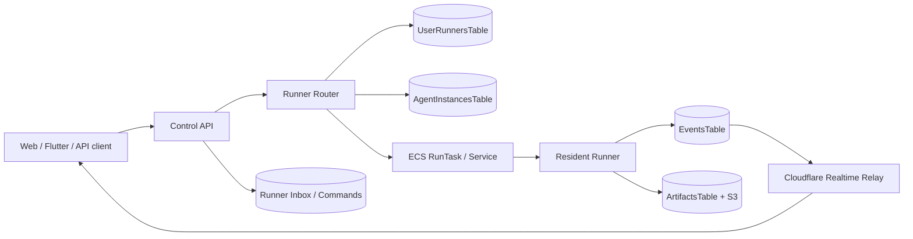

# Resident Runner Production Routing Plan

Workstream: Agent Harness
Date: 2026-05-10
Status: live real-Hermes ECS task definition deployed and exercised; modular per-user routing still pending

## Live Deployment Result

Deployed stacks:

```text
agents-cloud-dev-state
agents-cloud-dev-runtime
```

New deployed resources:

```text
AgentProfilesTable:
  agents-cloud-dev-state-AgentProfilesTableFF4D8E5F-OKROMINWG46P

Resident runner task definition:
  arn:aws:ecs:us-east-1:625250616301:task-definition/agents-cloud-dev-resident-runner:4

Resident runner container:
  resident-runner

Hermes auth bootstrap secret:
  agents-cloud/dev/resident-runner/hermes-auth-json
```

Latest live ECS real-Hermes task:

```text
arn:aws:ecs:us-east-1:625250616301:task/agents-cloud-dev-cluster/264c24cc42374834b3c006a56822069b
```

Result:

- task pulled the resident image from ECR,
- resident HTTP server started in ECS mode,
- task-level Secrets Manager injection wrote Hermes auth to
  `$HERMES_HOME/auth.json`,
- local task HTTP `/health` succeeded,
- local task HTTP `/wake` succeeded and invoked
  `/opt/hermes/.venv/bin/hermes`,
- one heartbeat was created,
- one report artifact was created in local task storage,
- five canonical events were emitted in local task storage because the real
  provider call failed visibly,
- Hermes reached the OpenAI Codex backend and returned HTTP `429`
  `usage_limit_reached` for `gpt-5.5`; this is the current external provider
  quota blocker,
- `/shutdown` completed,
- ECS task exited with code `0`.

The current live exercise is intentionally local-to-task. Events and artifacts
are not yet written to DynamoDB/S3 by the resident runner.

## Current Live Shape

```mermaid
flowchart LR
  Operator[AWS CLI manual run-task] --> ECS[ECS Fargate task]
  ECS --> Runner[resident-runner HTTP server]
  Runner --> LocalState[/runner/state/*.json + events.ndjson]
  Runner --> LocalArtifacts[/runner/artifacts]
  Runner --> Logs[CloudWatch Logs]
```

This proves the container, image asset, task definition, task role, networking,
logs, and in-container runtime loop work in the deployed AWS account.

## Target Modular Routing Shape



## Required Routing Contracts

Each user-runner record needs enough data for routing:

```text
runnerId
orgId
userId
workspaceId
status
desiredState
taskArn
taskDefinitionArn
clusterArn
containerName
networkTarget
lastHeartbeatAt
startedAt
stoppedAt
runnerSessionId
runnerApiTokenSecretRef or command-channel identity
activeAgentIds
```

The Control API should route by:

```text
orgId + userId + workspaceId -> active runnerId -> ECS taskArn / command channel
```

If no active runner exists:

1. Create or upsert `UserRunnersTable` record with `desiredState=starting`.
2. Run the resident ECS task with tenant env overrides.
3. Record `taskArn`, `runnerSessionId`, and expected heartbeat deadline.
4. Wait for first heartbeat or mark startup failed.

## Required Command Flow

Do not route arbitrary public traffic directly to the task until auth and
networking are finished. The first production path should use an internal
command channel:

```text
POST /work-items or /runs
  -> Control API authorizes tenant/workspace
  -> Control API finds/starts runner
  -> Control API writes command/inbox item
  -> runner polls or receives wake
  -> runner writes canonical events/artifacts
  -> realtime relay streams visible updates
```

Later, if direct HTTP is needed, put it behind internal service discovery or a
private load balancer with:

- token-per-runner or mTLS,
- security group ingress only from Control API/VPC resources,
- no public internet ingress,
- per-request tenant assertion inside the runner.

## Required Durable Adapters

The resident runner currently has local state only. Production routing needs
these ports wired:

```text
RunnerStateStore
  -> UserRunnersTable heartbeat/status/taskArn updates

AgentInstanceStore
  -> AgentInstancesTable profile/session/status/nextWakeAt updates

EventSink
  -> EventsTable canonical run.status/artifact.created/tool.approval events

ArtifactSink
  -> S3 artifact upload
  -> ArtifactsTable metadata record

SnapshotStore
  -> S3 workspace/snapshot object writes
  -> RunnerSnapshotsTable manifest records

InboxStore
  -> command, user reply, approval decision, cancel, resume, wake timer messages
```

## Per-User Modularity Work

Needed next:

- spawn one resident runner per user/workspace placement decision,
- allow multiple logical agents inside that runner,
- persist logical agent profile versions from Agent Workshop,
- add wake timers and scheduled work,
- add cancellation and duplicate wake idempotency,
- add approval resume/reject handling,
- upload artifacts to S3 instead of task-local disk,
- relay canonical events to Cloudflare realtime,
- add stale-runner sweeper that marks runners stale when heartbeat is old,
- add task cleanup policy for stopped or failed runners,
- add a client-visible status model:
  `starting`, `ready`, `running`, `waiting_for_user`, `waiting_for_approval`,
  `stale`, `failed`, `stopped`.

## Auth Boundary

Do not bake Codex, OpenAI, OpenRouter, or ChatGPT credentials into the Docker
image. Use one of:

- AWS Secrets Manager secret referenced by runner/task,
- provider API key scoped to the tenant/workspace,
- brokered credential reference resolved by Control API,
- private trusted-runner OAuth bootstrap only after session policy and
  revocation are approved.

The deployed resident task should default to `AGENTS_RESIDENT_ADAPTER=hermes-cli`
and receive Hermes auth only through Secrets Manager or the token-protected
runner credential upload route. Public multi-tenant launch still requires a
brokered per-user/provider credential model instead of sharing one auth JSON
across runners.
