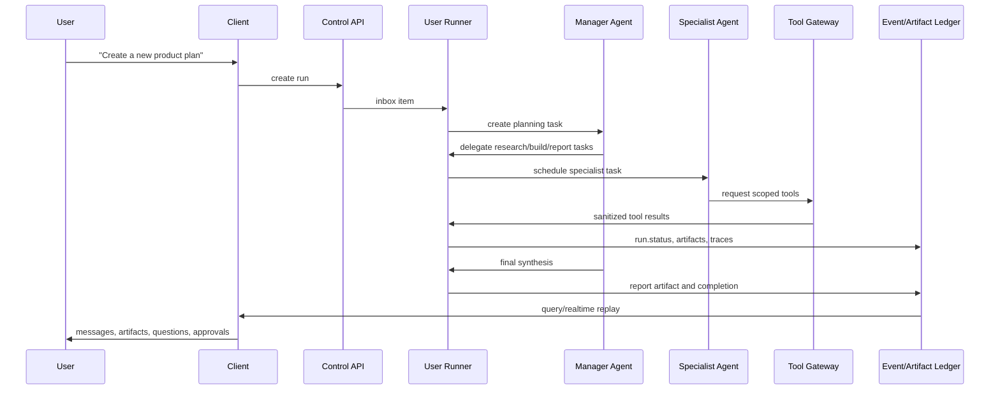
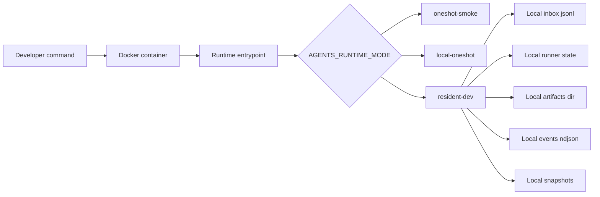
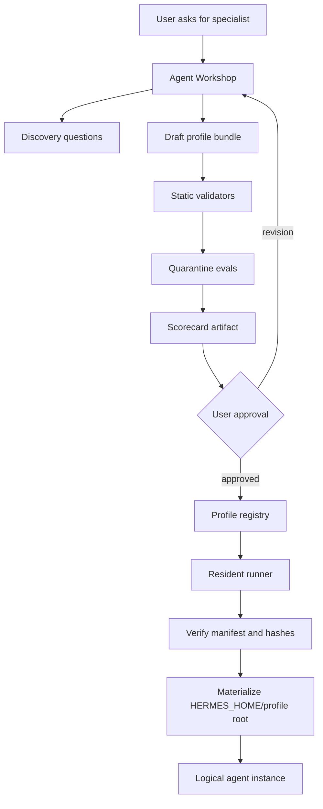
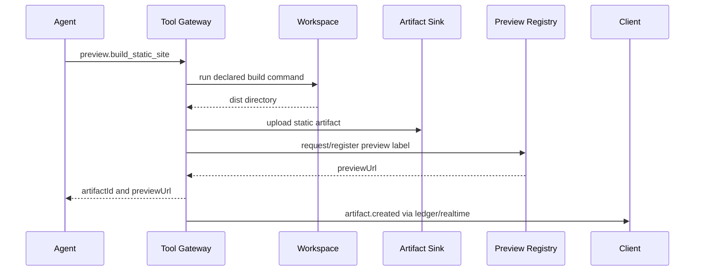
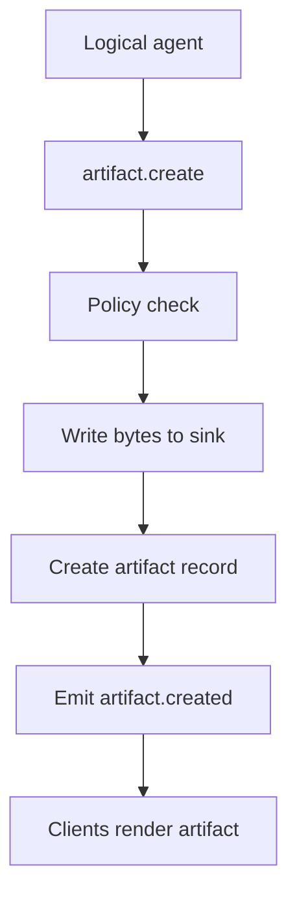
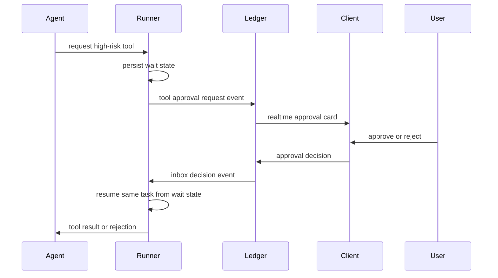
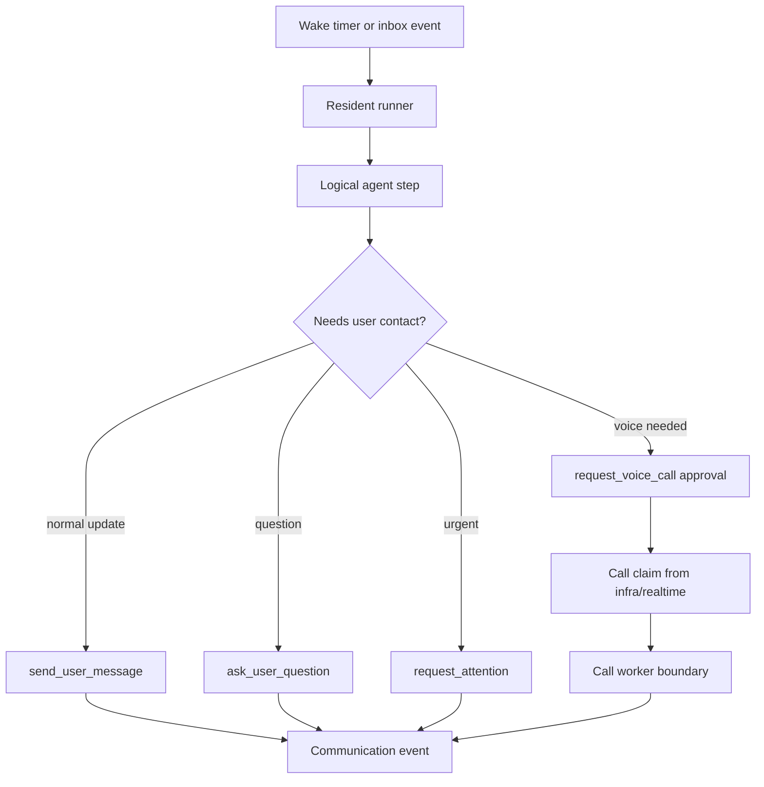
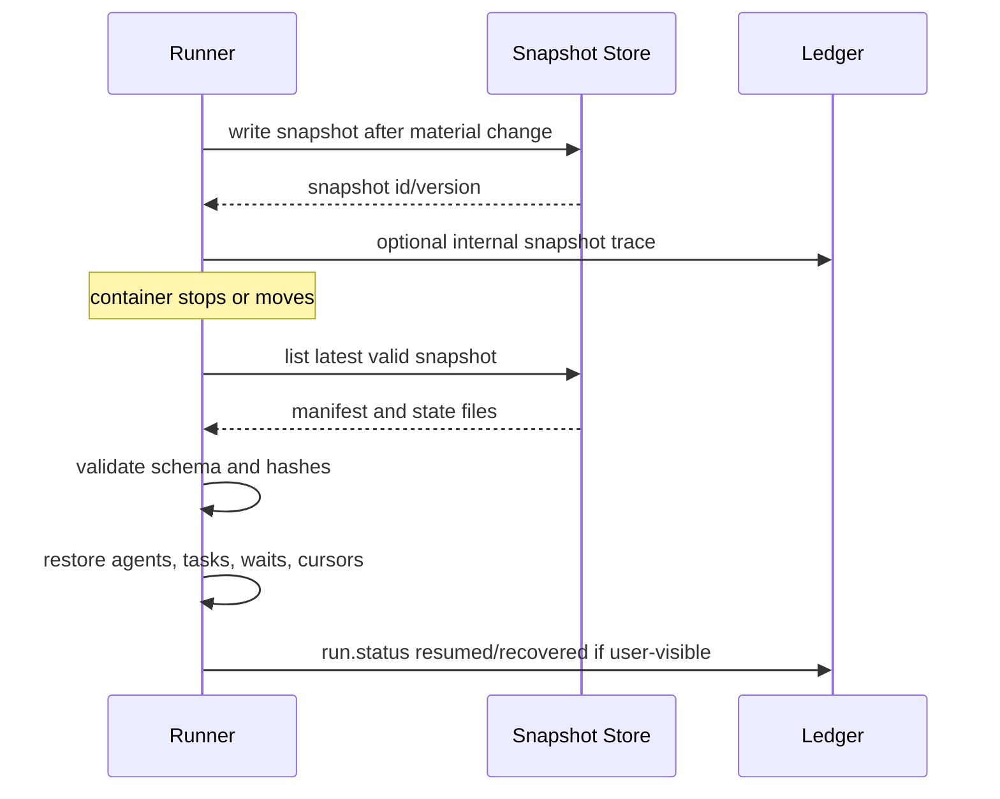
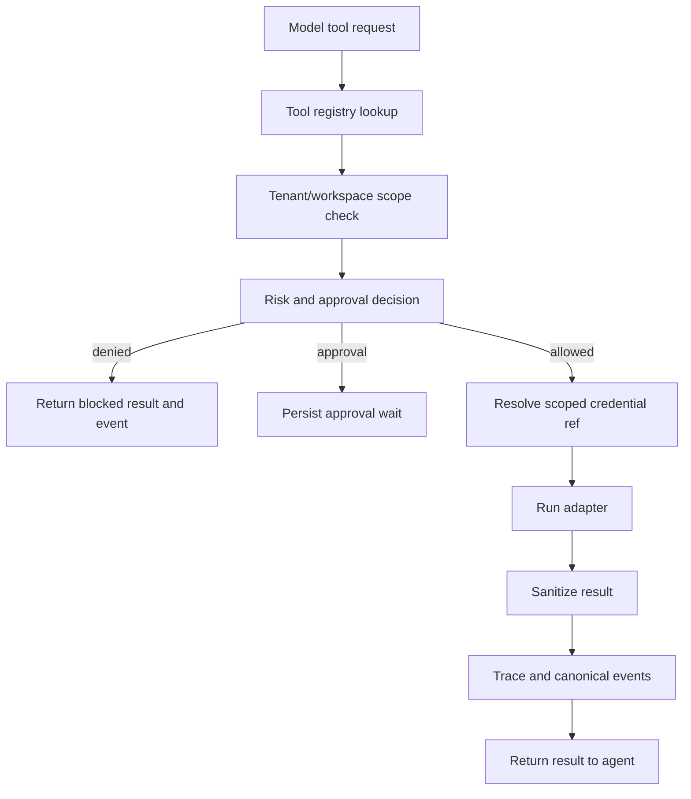

# Runtime Workflow Visuals

Workstream: Agent Harness
Date: 2026-05-10
Status: reference workflows for implementation planning

## 1. CEO Objective To Agent Team

Runtime requirements:

- task records for delegation,
- logical agent instances inside the runner,
- tool policy gateway,
- event ordering and idempotency,
- artifact records,
- resumable wait states.

## 2. Local Docker ECS Emulation

Runtime requirements:

- local event/artifact/state/inbox/snapshot adapters,
- non-root writable paths,
- no host Docker socket,
- env contract aligned with ECS.

## 3. Agent Workshop To Runtime Profile

Runtime requirements:

- profile manifest verifier,
- profile materialization state,
- logical agent registry,
- profile/tool policy bridge,
- event/artifact output for materialization.

## 4. Website Preview Workflow

Runtime requirements:

- build command policy,
- artifact upload,
- preview registration adapter,
- label collision handling,
- no direct DNS mutation from agent code.

## 5. Artifact Creation Workflow

Runtime requirements:

- stable artifact IDs,
- content type,
- S3/local sink parity,
- optional preview URL,
- duplicate suppression.

## 6. Approval Gate Workflow

Runtime requirements:

- wait state persisted before event,
- approval expiry,
- idempotent decisions,
- rejection path visible to agent and user,
- same task resumes after approval.

## 7. Proactive Message Or Call

Runtime requirements:

- explicit wake timer or inbox trigger,
- communication cadence policy,
- call claim parser,
- communication sink,
- failure and timeout events.

## 8. Snapshot And Restore

Runtime requirements:

- versioned manifest,
- checksum verification,
- event cursor persistence,
- retry-safe restore,
- stale-runner behavior when heartbeat expires.

## 9. Tool Execution Policy

Runtime requirements:

- normalized tool descriptors,
- profile policy bridge,
- scoped credential refs,
- result sanitization,
- idempotency ledger.

